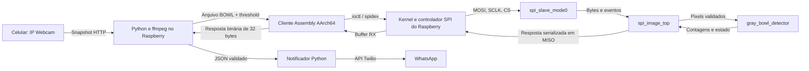
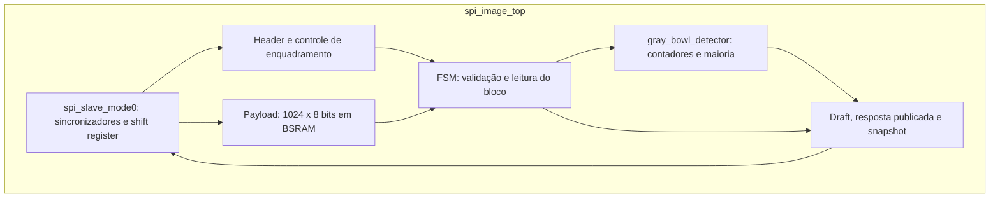

# Arquitetura técnica do sistema de monitoramento de ração

**Escopo:** software Linux AArch64, protocolo SPI e hardware RTL implementado na Tang Nano 4K.  
**Data de referência:** 22/09/2026.  
**Base documental:** [Auditoria Assembly](AUDITORIA_Assembly.md) e [Auditoria Verilog](AUDITORIA_Verilog.md), confrontadas com os fontes e relatórios de implementação disponíveis em `pb`.

## 1. Objetivo, método e limites

Este documento descreve os recursos efetivamente empregados no projeto, a distribuição de responsabilidades e os contratos de dados entre os componentes. O inventário de Assembly cobre as instruções, registradores, diretivas e syscalls presentes no cliente. O inventário de Verilog cobre as construções da linguagem nos três módulos sintetizáveis e distingue os mecanismos exclusivos dos testbenches. Recursos disponíveis na placa, mas ausentes do processamento atual, são identificados separadamente.

As auditorias de 21/09/2026 são a base histórica. Há evidências adicionais: relatórios Gowin em `assessment/impl`, com place-and-route datado de 22/09/2026 às 01:59:38, e o [ensaio físico documentado](RELATORIO_FIM_A_FIM_2026-09-22.md). Por isso, a inferência de BSRAM, anteriormente pendente, agora pode ser sustentada pelos relatórios. A descrição preserva três níveis de evidência:

| Nível | O que permite afirmar | Limite |
|---|---|---|
| Código-fonte | Formatos, algoritmo, controle, interfaces e recursos descritos | Não determina sozinho ocupação final ou timing físico. |
| Relatório de síntese/PnR | Mapeamento e estimativas da implementação produzida pela ferramenta | Não prova que o mesmo bitstream está gravado na placa, nem substitui medições. |
| Simulação e log de bancada | Comportamento dos cenários exercitados | Não constituem cobertura exaustiva ou garantia para qualquer condição ambiental. |

Não foi executada nova síntese para elaborar este documento. A netlist disponível está protegida por `pragma protect`; a atribuição dos recursos físicos apoia-se nos relatórios legíveis. Os caminhos dos fontes constam do build, mas não há manifesto de hashes que vincule inequivocamente fonte, bitstream e ensaio de bancada.

## 2. Visão geral e divisão de responsabilidades



| Componente | Função efetiva |
|---|---|
| Celular/IP Webcam | Disponibiliza fotografia pela rede. O Raspberry inicia a requisição. |
| `camera_capture.py` e ffmpeg | Aquisição HTTP, crop opcional, escala 160 × 120, conversão GRAY8, preparação do arquivo, execução do cliente e publicação JSON. |
| `spi_image_client.s` | Validação do arquivo, configuração SPI, criação de pacotes, CRC, transmissão, polling e validação de respostas. |
| Driver Linux `spidev` | Interface de dispositivo de caracteres para configurar e executar transferências no controlador SPI do Raspberry. |
| `spi_slave_mode0.v` | Recepção e transmissão serial de bits, reconstrução de bytes e eventos de seleção. |
| `spi_image_top.v` | Enquadramento, CRC, validação de sequência, armazenamento de um bloco e coordenação do detector. |
| `gray_bowl_detector.v` | Contagem de pixels acima do threshold e decisão por maioria no final do frame. |
| `bowl_notifier.py` | Validade temporal, confirmação por frames distintos, controle de episódio e chamada à API de mensagens. |
| Bash e systemd | Preparação do ambiente, verificação inicial, início automático e reinício dos processos. |

O Assembly executa na CPU AArch64 do Raspberry. O Cortex-M3 disponível no dispositivo da Tang não executa esse programa e não é utilizado pelo RTL atual. A aplicação da FPGA é lógica digital dedicada. O projeto também não utiliza a interface DVP ou HDMI da Tang para adquirir ou exibir imagens.

## 3. Entrada de pixels no Raspberry e formato BOWL

### 3.1 Aquisição e transformação

O Python obtém um snapshot HTTP, limita o volume recebido a 5 MiB e usa timeout de socket de cinco segundos. Há uma verificação de duração global de dez segundos entre leituras; ela não interrompe instantaneamente uma leitura bloqueada. O ffmpeg aplica `crop`, quando configurado, seguido de `scale=160:120`, extrai um frame e grava `rawvideo` com `pix_fmt=gray`. O subprocesso de conversão possui timeout de 15 segundos.

O resultado é uma sequência de **19.200 bytes**, um valor de intensidade sem sinal de oito bits por pixel, de 0 a 255. A ordem é a ordem raster do quadro convertido, com 160 bytes por linha. A FPGA não recebe JPEG, HTTP, cabeçalho de imagem nem canais RGB. O algoritmo usa a contagem global de intensidades; não reconstrói coordenadas x/y.

O Python grava `frame.bowl` em diretório temporário exclusivo e inicia o binário por `subprocess.run`, com timeout de 15 segundos. Os pixels chegam ao Assembly por leitura de arquivo, não por socket, GPIO ou pipe. O threshold chega separadamente como argumento decimal. Fonte: [camera_capture.py](../assembly/camera_capture.py).

### 3.2 Layout do arquivo local

`struct.Struct('<4sBBHIHHIIQQQ')` define o cabeçalho little-endian de 48 bytes. O arquivo completo possui **19.248 bytes**.

| Offset em bytes | Tamanho | Campo | Tratamento pelo Assembly |
|---:|---:|---|---|
| 0 | 4 | Magic ASCII `BOWL` | Exige palavra `0x4C574F42` em little-endian. |
| 4 | 1 | Versão = 1 | Validada junto com formato e tamanho. |
| 5 | 1 | Formato = 1, GRAY8 | Validado. |
| 6 | 2 | Cabeçalho = 48 | Validado. |
| 8 | 4 | `frame_id` | Copiado para os comandos SPI; o cliente não exige valor diferente de zero. |
| 12 | 2 | Largura = 160 | Validada. |
| 14 | 2 | Altura = 120 | Validada. |
| 16 | 4 | Total = 19.200 | Validado. |
| 20 | 4 | Reservado = 0 | Validado. |
| 24 | 8 | Tempo monotônico de início da captura | Preservado no arquivo, mas não utilizado nem enviado pelo Assembly. |
| 32 | 8 | Identificador de sessão | Não enviado no protocolo SPI. |
| 40 | 8 | Reservado = 0 | Validado. |
| 48 | 19.200 | Pixels GRAY8 | Divididos em blocos de até 1.024 bytes. |

O cabeçalho BOWL é um contrato local entre Python e Assembly. Ele **não é copiado integralmente para MOSI**. O Assembly produz um cabeçalho de comando SPI próprio e um payload BEGIN de 16 bytes.

## 4. Implementação Assembly AArch64

### 4.1 Ambiente de execução, entrada e build

O arquivo [spi_image_client.s](../assembly/spi_image_client.s) usa sintaxe GNU assembler e ponto de entrada `_start`, sem `main`, libc ou runtime C. O [Makefile](../assembly/Makefile) monta com `as -g` e liga com `ld --static`. Em Linux x86, `PREFIX=aarch64-linux-gnu` seleciona o toolchain cruzado e QEMU permite executar o ELF. No Raspberry, é necessário sistema Linux de 64 bits compatível com AArch64.

Interface de execução:

```text
spi_image_client INPUT OUTPUT THRESHOLD DEVICE
spi_image_client INPUT OUTPUT THRESHOLD --emit
```

Na entrada, o programa lê `argc` em `[sp]` e exige cinco argumentos contando o nome do executável. Os ponteiros para INPUT, OUTPUT, THRESHOLD e DEVICE estão, respectivamente, em `[sp+16]`, `[sp+24]`, `[sp+32]` e `[sp+40]`. O modo `--emit` gera somente comandos em arquivo e não acessa a FPGA.

O threshold é convertido dígito a dígito por `madd`, multiplicando o acumulador por dez e somando o dígito. Strings vazias, caracteres não decimais e resultados acima de 255 são rejeitados. O limite é verificado a cada iteração, antes de qualquer crescimento descontrolado do acumulador.

### 4.2 Seções, diretivas e memória estática

| Recurso GNU assembler | Uso no projeto |
|---|---|
| `.global _start` | Exporta o símbolo de entrada ao linker. |
| `.section .text` | Código executável. |
| `.section .rodata` | Mensagens, string `--emit` e `timespec` de espera. |
| `.section .data` | Modo SPI, bits por palavra e velocidade inicializados. |
| `.section .bss` e `.skip` | Buffers estáticos inicialmente zerados pelo carregamento do processo. |
| `.ascii` / `.asciz` | Mensagens com tamanho explícito e string terminada em zero. |
| `.byte` / `.word` / `.quad` | Dados de 8, 32 e 64 bits; `.quad 0,1000000` representa a espera. |
| `.equ`, `.` e diferenças de símbolos | Cálculo do comprimento das mensagens em montagem. |
| `.balign 4` / `.balign 16` | Alinhamento da velocidade e do início dos buffers. Não alinham automaticamente todos os buffers subsequentes. |
| Rótulos e `ldr reg, =símbolo/constante` | Referência a rotinas, buffers e constantes por pseudo-instrução; o assembler resolve a forma concreta/literal pool. |
| Comentários `//` | Documentação de contratos e decisões, sem efeito no binário. |

| Buffer em `.bss` | Bytes | Finalidade |
|---|---:|---|
| `frame` | 19.248 | Arquivo BOWL completo. |
| `packet` | 1.042 | 16 bytes de cabeçalho + 1.024 de payload + 2 de CRC. |
| `reply_tx` | 37 | F0 no primeiro byte e zeros para gerar os clocks da leitura. |
| `reply_rx` | 37 | Recepção SPI, incluindo os cinco bytes anteriores ao envelope. |
| `xfer` | 32 | Estrutura Linux `spi_ioc_transfer`. |
| `begin_data` | 16 | Dimensões, formato, threshold e total do BEGIN. |
| `scratch` | 16 | Área auxiliar; um byte é usado para testar dados excedentes após o frame. |
| **Total declarado** | **20.428** | Soma dos `.skip`; não representa o RSS total do processo ou o tamanho do ELF. |

Não há alocação dinâmica no Assembly. O programa mantém apenas um frame por processo e um comando pendente. Os campos reservados de `begin_data` e os dummy bytes permanecem zero devido à inicialização de `.bss`.

### 4.3 Tabela de registradores

`xN` é a visão de 64 bits e `wN` a visão baixa de 32 bits do mesmo registrador. Escritas em `wN` zeram a parte superior de `xN`. Ponteiros e descritores usam a visão de 64 bits; contagens, IDs e cálculo CRC usam frequentemente 32 bits. A tabela descreve o uso **neste programa**, não um mapa de registradores periféricos.

| Registrador | Papel no cliente |
|---|---|
| `x0/w0` | Primeiro argumento e retorno de rotinas/syscalls; opcode; endereço TX; retorno CRC; valores temporários. |
| `x1/w1` | Segundo argumento; pathname, ponteiro de buffer/RX, comprimento para CRC, payload length ou request ioctl, conforme a rotina. |
| `x2/w2` | Terceiro argumento: flags, comprimento, offset ou ponteiro ioctl; byte corrente no CRC/parser. |
| `x3/w3` | Quarto argumento: modo de criação de arquivo ou ponteiro de payload; multiplicador decimal e contador de oito bits do CRC. |
| `w4` | Acumulador CRC16, mantido com máscara `0xFFFF`. |
| `w5` | Teste do bit `0x8000` do CRC antes do deslocamento. |
| `x6/w6` | Não utilizado explicitamente. |
| `w7` | Polinômio `0x1021` do CRC. |
| `x8` | Número da syscall Linux. |
| `x9/w9` | Temporário para endereços de buffers/estrutura, descritor nos loops de I/O e constante F0. |
| `x10/w10` | Índices de cópia, tamanhos, constantes e campos lidos para validação. |
| `w11` | Byte copiado, constantes e valores esperados em comparações. |
| `x12` | Endereço auxiliar de payload; comprimento esperado durante `transfer`. |
| `x13–x18` | Não utilizados explicitamente. |
| `x19` | Descritor de entrada durante a leitura; fechado antes da comunicação SPI. |
| `x20` | Ponteiro OUTPUT inicialmente; depois descritor do arquivo de saída. |
| `x21` | String DEVICE/`--emit` inicialmente; no modo físico passa a guardar o descritor spidev. |
| `x22` | Seleção do modo: 0 físico, 1 emissão offline. |
| `w23` | Identificador do frame, extraído do cabeçalho BOWL. |
| `w24/x24` | Sequência do comando; inicia em zero e avança após sucesso/emissão. |
| `w25/x25` | Offset de pixels já enviados. |
| `w26` | Comprimento do bloco corrente, no máximo 1.024. |
| `x27` | Ponteiro INPUT inicialmente; depois base de `frame`. |
| `w28` | Threshold de intensidade, 0–255. |
| `x29` | Salvo/restaurado em `command`; não é estabelecido como frame pointer por `mov x29,sp`. |
| `x30` | Link register atualizado por `bl`; preservado em `command`, que faz chamadas aninhadas. |
| `sp` | Acesso inicial a argc/argv e frame de pilha de 48 bytes em `command`. |
| `xzr` | Fonte constante zero para limpar a estrutura de transferência com `stp`. |
| Flags NZCV | Resultados de `cmp`, `cmn` e `subs`, usados pelos desvios condicionais e `csel`. |
| PC | Controle implícito de execução por saltos e retornos; não é um registrador geral nomeado no fonte. |

`command` usa uma convenção interna: `w0=opcode`, `w1=payload_len`, `w2=offset`, `x3=payload`. Preserva o estado de longa duração em x19–x28, exceto a sequência x24, deliberadamente incrementada. A organização se aproxima das funções dos registradores no AAPCS64, mas não constitui uma interface C genérica estritamente preservadora de todos os callee-saved, pois x24 é alterado por contrato. A referência de ABI é o [AAPCS64 da Arm](https://github.com/ARM-software/abi-aa/blob/main/aapcs64/aapcs64.rst).

Layout da pilha em `command`, após `stp x29,x30,[sp,#-48]!`:

| Offset relativo a sp | Conteúdo |
|---:|---|
| 0 | x29 salvo |
| 8 | x30 salvo |
| 16 | x0 original: opcode |
| 24 | x1 original: comprimento |
| 32 | Contador de tentativas de leitura |
| 40–47 | Espaço sem uso explícito |

Os 48 bytes mantêm o alinhamento de 16 bytes da pilha. O retorno restaura o par com `ldp ...,[sp],#48`.

### 4.4 Syscalls utilizadas

O cliente coloca o número da chamada em x8, argumentos em x0–x3 conforme necessário e executa `svc #0`. O resultado vem em x0; retornos negativos representam erros. A tabela abaixo contém **todas as sete syscalls distintas presentes no fonte**, com números do ABI Linux usado pelo cliente. Conferência numérica: [Linux, asm-generic/unistd.h](https://raw.githubusercontent.com/torvalds/linux/v6.6/include/uapi/asm-generic/unistd.h).

| Syscall | x8 decimal | Argumentos empregados | Finalidade e tratamento |
|---|---:|---|---|
| `ioctl` | 29 | x0=fd, x1=request, x2=ponteiro | Configura SPI e executa `SPI_IOC_MESSAGE(1)`; configuração rejeita retorno negativo; transferência exige retorno igual ao comprimento. |
| `openat` | 56 | x0=−100 (`AT_FDCWD`), x1=path, x2=flags, x3=mode | Abre entrada, spidev e saída; retorno negativo leva a falha. |
| `close` | 57 | x0=fd | Fecha entrada e saída. O retorno do fechamento da saída é verificado; o da entrada não. |
| `read` | 63 | x0=fd, x1=buffer, x2=count | Lê exatamente 19.248 bytes e depois testa EOF com leitura de um byte. |
| `write` | 64 | x0=fd, x1=buffer, x2=count | Grava comandos offline, resposta final ou mensagem em stderr. |
| `exit` | 93 | x0=0 ou 1 | Encerra o processo com sucesso ou falha; não usa `exit_group`. |
| `nanosleep` | 101 | x0=&timespec, x1=NULL | Solicita 1 ms entre consultas; seu retorno não é verificado nem a espera restante retomada. |

Flags de `openat`: entrada = 0 (`O_RDONLY`); spidev = 2 (`O_RDWR`); saída = 193 decimal (`O_WRONLY | O_CREAT | O_EXCL`). A saída solicita modo 384 decimal, equivalente a `0600`, sujeito à umask. Um arquivo de saída existente é rejeitado, evitando truncamento.

`read_exact` e `write_all` tratam operações parciais, avançam ponteiro/reduzem comprimento e repetem em `−EINTR`, identificado por `cmn x0,#4`. EOF prematuro ou retorno não positivo gera falha. A leitura adicional de EOF não possui o mesmo retry de EINTR. Não há `mmap`, acesso a `/dev/mem`, socket, `execve`, threads ou configuração direta de registradores GPIO neste Assembly. O fechamento do descritor SPI remanescente ocorre implicitamente ao terminar o processo.

### 4.5 Instruções e modos de endereçamento efetivamente usados

| Grupo | Instruções presentes | Aplicação |
|---|---|---|
| Transferência de dados | `mov`, `ldr`, `ldrb`, `ldrh`, `str`, `strb`, `strh`, `stp`, `ldp` | Constantes, ponteiros, estruturas binárias, cópia de bytes, salvamento de pilha e limpeza de memória. |
| Aritmética inteira | `add`, `sub`, `subs`, `madd` | Offsets, tamanhos, contadores e conversão decimal; `subs` também atualiza flags. |
| Comparação/seleção | `cmp`, `cmn`, `csel` | Validação, reconhecimento de EINTR e mínimo entre restante e 1.024. |
| Lógica/deslocamento | `and`, `eor`, `lsl` | Máscara de 16 bits e atualização do CRC. `eor` também usa operando deslocado `lsl #8`. |
| Saltos | `b`, `b.eq`, `b.ne`, `b.hi`, `b.hs`, `b.lo`, `b.le` | Fluxos e limites; condições unsigned para campos binários e signed para resultados de I/O. |
| Testes diretos | `cbz`, `cbnz`, `tbnz` | Zero/não zero e teste do bit 63 de retorno negativo. |
| Chamadas/retorno | `bl`, `ret` | Rotinas locais e retorno por x30. |
| Entrada no kernel | `svc` | Syscalls Linux. |

Endereçamentos presentes: base simples `[xN]`, base com imediato `[xN,#offset]`, base com índice `[xN,xM]`, pós-incremento `[xN],#1`, pré-decremento com atualização de sp e pós-incremento de sp. `ldr =...` é uma pseudo-instrução, não leitura direta de um periférico. Não são usadas instruções de ponto flutuante, NEON/SIMD, exclusivas/atômicas ou instrução CRC dedicada.

### 4.6 Rotinas e sequência do programa

| Rotina/bloco | Papel |
|---|---|
| `_start`, `parse_threshold` | Valida argumentos e threshold. |
| `read_exact` | Carrega o frame completo; `_start` valida cabeçalho e ausência de bytes extras. |
| `compare_emit`, `open_spi`, `config_ioctl` | Seleciona emissão offline ou dispositivo físico e configura o controlador. |
| `make_begin`, `block_loop` | Monta BEGIN e divide o frame em blocos consecutivos. |
| `command` | Serializa cabeçalho/payload/CRC; transmite ou grava; consulta e valida a resposta. |
| `crc16` | Processa bytes sequencialmente e oito iterações de bits por byte. |
| `transfer` | Monta a estrutura de ioctl e solicita uma transferência síncrona. |
| `write_all` | Garante escrita completa da saída. |
| `success`, `show_usage`, `fail`, `exit_error` | Fecha saída quando apropriado, emite diagnóstico e encerra. |

O modo físico começa por GET_INFO e valida identificador, capacidade de bloco e versão do protocolo. Depois envia BEGIN, blocos e END, solicita GET_RESULT e grava apenas os 32 bytes do envelope final. Em erro, pode restar um arquivo parcial; o supervisor só publica sucesso se subprocesso e parser terminarem corretamente.

## 5. Comunicação SPI e protocolo de aplicação

### 5.1 Camada elétrica e responsabilidade do driver

O Raspberry é o master: controla SCLK e CS, transmite em MOSI e recebe em MISO. A FPGA é slave. São usados modo 0 (CPOL=0, CPHA=0), oito bits por palavra e ordem MSB-first dentro de cada byte. A frequência solicitada é 100.000 Hz; não há medição da frequência efetiva no log.

O spidev abstrai o controlador: o Assembly não alterna os GPIOs por software. Transferências com `SPI_IOC_MESSAGE` podem receber e transmitir simultaneamente; CS delimita a mensagem. A aplicação envia um comando em uma mensagem e consulta a resposta em outra. Referência: [SPI userspace API do Linux](https://docs.kernel.org/spi/spidev.html).

| Sinal | Sentido | Raspberry, pino físico | Pino do encapsulamento Tang definido no CST |
|---|---|---:|---:|
| MOSI | Raspberry → FPGA | 19 | 42 |
| MISO | FPGA → Raspberry | 21 | 43 |
| SCLK | Raspberry → FPGA | 23 | 41 |
| CS/CE0, ativo baixo | Raspberry → FPGA | 24 | 40 |
| GND | Referência comum | GND | GND da placa |

Os números da Tang são do encapsulamento, não posições do conector. O relatório PnR confirma as atribuições aos sinais do projeto; a correspondência física do conector deve ser conferida no esquema da revisão da placa. MISO é colocado em alta impedância quando CS físico está alto.

### 5.2 Configuração ioctl e estrutura de transferência

| Request hexadecimal no Assembly | Nome | Valor/payload |
|---|---|---|
| `0x40016B01` | `SPI_IOC_WR_MODE` | Ponteiro para byte 0. |
| `0x40016B03` | `SPI_IOC_WR_BITS_PER_WORD` | Ponteiro para byte 8. |
| `0x40046B04` | `SPI_IOC_WR_MAX_SPEED_HZ` | Ponteiro para u32 = 100.000. |
| `0x40206B00` | `SPI_IOC_MESSAGE(1)` | Ponteiro para uma estrutura de 32 bytes. |

O cliente não faz leitura de confirmação da configuração e não emite um ioctl separado de LSB-first. A palavra de modo zero é a configuração desejada; a serialização do slave é MSB-first. Os valores ioctl são específicos do ABI utilizado e não devem ser tratados como constantes portáveis a qualquer sistema operacional.

Layout preenchido por `transfer`:

| Offset | Bytes | Campo | Valor usado |
|---:|---:|---|---|
| 0 | 8 | `tx_buf` | Endereço do pacote ou de `reply_tx`. |
| 8 | 8 | `rx_buf` | Zero ao enviar comando; `reply_rx` ao consultar. |
| 16 | 4 | `len` | Tamanho do pacote ou 37. |
| 20 | 4 | `speed_hz` | 100.000. |
| 24 | 2 | `delay_usecs` | Zero. |
| 26 | 1 | `bits_per_word` | 8. |
| 27 | 1 | `cs_change` | Zero. |
| 28 | 1 | `tx_nbits` | Zero, sem seleção de modo multilinha. |
| 29 | 1 | `rx_nbits` | Zero. |
| 30 | 1 | `word_delay_usecs` | Zero. |
| 31 | 1 | Padding | Zero. |

A estrutura inteira é zerada antes do preenchimento. Os campos e o tamanho são compatíveis com o [header UAPI spidev.h do Linux](https://raw.githubusercontent.com/torvalds/linux/master/include/uapi/linux/spi/spidev.h). O controlador pode escolher mecanismos internos de transferência; o cliente não configura DMA nem recebe comprovação de seu uso.

### 5.3 Pacote de comando

Todos os inteiros multibyte são little-endian, embora os bits de cada byte sejam transmitidos MSB-first. Essas duas convenções operam em níveis diferentes.

| Offset | Bytes | Campo |
|---:|---:|---|
| 0 | 2 | Magic `42 57`, ASCII `BW`; corresponde a `strh 0x5742`. |
| 2 | 1 | Versão = 1. |
| 3 | 1 | Opcode. |
| 4 | 4 | Frame ID. |
| 8 | 2 | Sequência. |
| 10 | 2 | Comprimento do payload, 0–1.024. |
| 12 | 4 | Offset de pixels; zero nas operações que não são bloco. |
| 16 | L | Payload. |
| 16+L | 2 | CRC16 sobre os 16+L bytes anteriores. |

Comprimento total = `18 + L`; máximo = 1.042 bytes. A FPGA só aceita o comando após encerrar CS e conferir tamanho, formato e CRC. Bytes de payload podem ter sido escritos no buffer antes dessa validação, mas só serão encaminhados ao detector se o comando for aceito.

### 5.4 BEGIN e sequência completa

Payload BEGIN, 16 bytes:

| Offset dentro do payload | Bytes | Campo |
|---:|---:|---|
| 0 | 2 | Largura = 160. |
| 2 | 2 | Altura = 120. |
| 4 | 1 | Formato = 1. |
| 5 | 1 | Reservado = 0. |
| 6 | 1 | Threshold. |
| 7 | 1 | Reservado = 0. |
| 8 | 4 | Reservado = 0. |
| 12 | 4 | Total de pixels = 19.200. |

| Sequência | Opcode | Operação | Payload | Offset |
|---:|---|---|---:|---:|
| 0 | `01` | GET_INFO | 0 | 0 |
| 1 | `10` | BEGIN | 16 | 0 |
| 2–19 | `11` | Primeiros 18 blocos | 1.024 cada | 0, 1.024, …, 17.408 |
| 20 | `11` | Último bloco | 768 | 18.432 |
| 21 | `12` | END | 0 | 0 |
| 22 | `13` | GET_RESULT | 0 | 0 |

ABORT (`14`) existe no RTL, com payload vazio, mas não é emitido no fluxo nominal do cliente. Isso evita apagar incondicionalmente o resultado anterior entre imagens.

Um byte de pixel do arquivo no offset `48+p` é copiado para o pacote na posição `16+j`, com `p=offset_do_bloco+j`; é serializado em MOSI, reconstruído como `rx_byte`, escrito em `payload[j]`, lido por `payload_rd`, transferido a `buffered_pixel` e consumido pelo detector quando `pixel_valid=1`. A resposta retorna contagens e estado, não a imagem.

### 5.5 Consulta e envelope de resposta

```mermaid
sequenceDiagram
    participant A as Assembly / master SPI
    participant F as FPGA
    A->>F: CS baixo; BW + cabeçalho + payload + CRC
    A->>F: CS alto encerra comando
    F->>F: Valida, processa e prepara resposta + CRC
    A->>A: nanosleep solicitado de 1 ms
    A->>F: Nova transação: F0 + 36 bytes zero
    F-->>A: 5 bytes de prefixo + envelope de 32 bytes
    A->>A: Confere CRC, opcode, ID, sequência e status
    Note over A,F: Se resposta antiga/inválida, repete a consulta; não retransmite o comando
```

O marcador F0 seleciona leitura, não é um comando BW. Nos 37 bytes recebidos, os índices 0–4 são descartados; o envelope está em 5–36. A folga de cinco bytes permite ao slave sincronizar a transação, reconhecer o marcador e selecionar os dados de resposta.

| Offset no envelope de 32 bytes | Bytes | Campo |
|---:|---:|---|
| 0 | 2 | Magic `42 52`, ASCII `BR`. |
| 2 | 1 | Versão 1. |
| 3 | 1 | Opcode respondido. |
| 4 | 4 | Frame ID ecoado. |
| 8 | 2 | Sequência ecoada. |
| 10 | 1 | Status: 0 sucesso, 2 erro no RTL atual. |
| 11 | 1 | Indicador de resultado válido nessa resposta. |
| 12 | 1 | Estado: 0 não vazio, 1 vazio, 2 desconhecido. |
| 13 | 3 | Reservados zero. |
| 16 | 4 | Campo `n`: total de pixels ou identificador em GET_INFO. |
| 20 | 4 | Campo `b`: claros ou capacidade de bloco em GET_INFO. |
| 24 | 4 | Próximo offset ou versão/capacidade 1 em GET_INFO. |
| 28 | 2 | Código de erro. |
| 30 | 2 | CRC dos primeiros 30 bytes. |

GET_INFO retorna `n=0x424F574C`, `b=1024`, terceiro campo = 1. Esse identificador u32 retorna os bytes `4C 57 4F 42`; não deve ser confundido com os bytes ASCII do cabeçalho BOWL. O ACK de bloco retorna o próximo offset; o cliente exige que corresponda ao total já enviado.

O RTL usa códigos de erro 1 (formato), 2 (CRC), 3 (ordem/parâmetros), 4 (resultado/frame inválido) e 5 (opcode desconhecido). A maioria das rejeições fecha o frame e invalida o detector. GET_RESULT indisponível gera resposta de erro sem acionar o mesmo aborto.

### 5.6 Integridade, espera e custos de comunicação

CRC16/CCITT-FALSE: polinômio `0x1021`, inicialização `0xFFFF`, processamento não refletido, sem XOR final. O resultado é serializado em little-endian. O vetor `123456789 → 0x29B1` é verificado no testbench. CRC detecta alterações acidentais; não oferece autenticação ou proteção criptográfica.

O Assembly consulta até 100 vezes por comando. Magic, versão, CRC ou identidade divergentes levam a nova consulta. Status 1 também solicita espera no cliente, mas o RTL atual não o produz. Durante ocupação, a FPGA pode ignorar um novo comando e disponibilizar o snapshot de resposta anterior. O master implementa, portanto, um comando pendente por vez.

Uma consulta de 37 bytes a 100 kHz ocupa aproximadamente 2,96 ms de clocks. Somada à pausa solicitada de 1 ms, cem consultas representam aproximadamente **396 ms**, antes de overhead de kernel/escalonamento. O comentário de cerca de 100 ms no Assembly contabiliza a espera, não todo o tempo de transferência. Esse número não é prazo de tempo real garantido.

Para um frame sem consultas extras:

| Parcela | Quantidade |
|---|---:|
| Pixels transmitidos | 19.200 bytes |
| Payload BEGIN | 16 bytes |
| Cabeçalhos e CRC dos 23 comandos | 414 bytes |
| Total de comandos (`--emit`) | 19.630 bytes |
| 23 consultas × 37 bytes | 851 períodos de byte |
| Total de períodos de byte no barramento | 20.481 |
| Tempo ideal de clocks a 100 kHz | 1,63848 s |
| Pausas de 1 ms, uma por comando | 0,023 s solicitados |

MOSI e MISO operam simultaneamente; não se deve dobrar o tempo por contar os dois fios. Aquisição HTTP, conversão, processamento, CRC em software e chamadas ao kernel acrescentam latência. Os 2,749 s médios observados no ensaio anterior são de captura até publicação, não uma medição isolada de SPI.

## 6. Arquitetura Verilog sintetizável

### 6.1 Hierarquia e organização temporal

O projeto [assessment.gprj](../verilog/assessment/assessment.gprj) inclui três módulos Verilog e os arquivos de restrições físicas e temporais. A síntese confirma `spi_image_top` como top-level.



Todos os blocos de estado do RTL são acionados pela borda positiva do clock interno nominal de 27 MHz. SCLK não é usado como clock de um `always`: suas transições são observadas após sincronização. Isso mantém recepção, parsing, RAM e detector no mesmo domínio funcional de clock.

### 6.2 `spi_slave_mode0`: serialização e sincronização

O módulo usa três cadeias de três bits, `sck_sync`, `cs_sync` e `mosi_sync`. A cada clock, a entrada externa é deslocada para a cadeia. A comparação dos estágios `[2:1]` de SCLK detecta subida (`01`) ou descida (`10`). CS usa lógica equivalente para produzir pulsos de seleção e desseleção.

Na subida detectada de SCLK, o bit sincronizado de MOSI é incorporado a `rx_shift`. Ao completar oito bits, o byte é disponibilizado em `rx_byte`, `rx_valid` pulsa e `byte_index` avança. Na descida detectada, `miso_r` recebe o bit apropriado de `tx_byte`, selecionado por `7-bit_index`. `partial_byte` identifica uma transação encerrada com número de bits incompleto.

| Estado do slave | Largura lógica | Função |
|---|---:|---|
| `sck_sync`, `cs_sync`, `mosi_sync` | 3 bits cada | Amostragem em estágios das entradas assíncronas. |
| `bit_index` | 3 | Posição do bit dentro do byte. |
| `rx_shift` | 8 | Deslocamento serial de recepção. |
| `rx_byte` | 8 | Byte concluído para o top. |
| `byte_index` | 16 | Índice de byte da transação, saturado em `0xFFFF`. |
| `miso_r` | 1 | Bit de saída registrado. |
| `rx_valid`, `selected`, `deselected`, `partial_byte` | 1 cada | Eventos/estado da interface. |

`assign miso = cs_n ? 1'bz : miso_r` usa CS físico para desabilitar a saída sem aguardar toda a sincronização. Não há filtro de glitches nem prova de imunidade a ruído. As cadeias reduzem a exposição da lógica interna à transição assíncrona, mas não eliminam matematicamente metastabilidade nem garantem coerência para qualquer frequência.

O contrato declarado exige pelo menos oito clocks internos por meia fase SCLK e por setup/hold de CS: aproximadamente 296 ns a 27 MHz. A 100 kHz, cada meia fase é nominalmente 5 µs, cerca de 135 clocks internos. Isso fornece folga para a técnica de oversampling; não substitui a verificação de CS, atrasos de placa e setup/hold de MISO no master.

### 6.3 `spi_image_top`: enquadramento, controle e estado

O top separa recepção da aplicação do comando. `count` identifica a posição do byte; `payload_len` delimita o payload; `rx_crc` é atualizado para cabeçalho e payload; os dois bytes finais formam `received_crc`. Pacotes maiores que o buffer ou com bytes extras são marcados como malformados. A decisão ocorre em DISPATCH após a desseleção.

| Grupo | Sinais/armazenamento | Função |
|---|---|---|
| FSM | `state[3:0]` | Nove estados descritos por constantes locais. A codificação física pode ser otimizada pela síntese. |
| Recepção | `count`, `payload_len`, `rx_crc`, `received_crc`, 16 bits cada | Limites e integridade do comando. |
| Flags de transação | `read_reply`, `malformed`, `ignore_command` | Distingue F0, formato inválido e início de transação com máquina ocupada. |
| Frame em andamento | `current_id[31:0]`, `offset[31:0]`, `last_seq[15:0]`, `frame_open` | Identidade, ordem e quantidade de pixels aceitos. |
| Caminho do pixel | `cursor[15:0]`, `payload_rd[7:0]`, `buffered_pixel[7:0]`, `threshold[7:0]` | Endereço e estágios da leitura síncrona até o detector. |
| Eventos do detector | `start_frame`, `abort_frame`, `end_frame`, `pixel_valid` | Pulsos de um clock, zerados por padrão em cada ciclo. |
| CRC da resposta | `crc_index[5:0]`, `reply_crc[15:0]` | Processa 30 bytes antes da publicação do envelope. |
| Campos combinacionais | `cmd_id`, `cmd_seq`, `cmd_offset` | Reconstrução little-endian por concatenação dos bytes do header. |

Regras específicas:

- BEGIN só é aceito sem frame aberto e com dimensões, formato, total e reservados corretos. Captura ID e threshold, reinicia offset e estabelece a sequência inicial recebida.
- Bloco exige frame aberto, ID atual, sequência imediatamente seguinte, payload não vazio, offset esperado e ausência de excesso de pixels.
- END exige frame completo e próxima sequência correta.
- GET_RESULT exige frame fechado, snapshot válido e ID igual ao resultado. O RTL ecoa a sequência solicitada, mas não exige que seja a sucessora de END. O cliente nominal usa 22.
- GET_INFO e ABORT não integram uma cadeia obrigatória de sequência no RTL. O contrato mais restrito do fluxo nominal é estabelecido pelo cliente.

### 6.4 Máquina de estados e latência interna

| Estado | Operação | Próximo estado principal |
|---|---|---|
| IDLE | Aguarda final de comando; a lógica de recepção opera no mesmo processo. | DISPATCH após CS subir. |
| DISPATCH | Valida e despacha opcode; rejeita ou inicia processamento. | READ_PIXEL, FINISH_FRAME ou REPLY_CRC. |
| READ_PIXEL | Dá tempo para a leitura síncrona de `payload[cursor]`. | LOAD_PIXEL. |
| LOAD_PIXEL | Copia `payload_rd` para `buffered_pixel`. | EMIT_PIXEL. |
| EMIT_PIXEL | Ativa `pixel_valid`; avança cursor ou termina bloco. | READ_PIXEL ou FINISH_BLOCK. |
| FINISH_BLOCK | Atualiza offset e prepara ACK do bloco. | REPLY_CRC. |
| FINISH_FRAME | Aguarda o detector observar o pulso `end_frame`. | WAIT_FRAME. |
| WAIT_FRAME | Observa validade/erro e contagens atualizadas. | REPLY_CRC por resposta ou rejeição. |
| REPLY_CRC | Atualiza CRC de um byte da resposta por clock e publica os 32 bytes. | IDLE. |

Como as atribuições sequenciais são não bloqueantes, `pixel_valid <= 1` em EMIT_PIXEL é observado pelo detector na borda seguinte. O mesmo se aplica a `start_frame` e `end_frame`. A separação FINISH_FRAME/WAIT_FRAME permite que o detector conclua o snapshot antes de o top montar a resposta.

O caminho do pixel consome aproximadamente três clocks por pixel, equivalentes a 9 milhões de pixels/s enquanto processa o bloco, a 27 MHz. Um bloco de 1.024 pixels exige aproximadamente 3.072 clocks, 113,78 µs, mais estados de controle e CRC da resposta, resultando em ordem de grandeza de 115 µs. Esse cálculo por ciclos não representa throughput sustentado de imagens: a transferência SPI e o software dominam a duração total.

### 6.5 BSRAM: uso, inferência e finalidade

`reg [7:0] payload[0:1023]` descreve **1.024 posições de oito bits**, ou 8.192 bits/1 KiB de dados úteis. A escrita ocorre no clock interno quando chega um byte de payload; a leitura é descrita como `payload_rd <= payload[cursor]`, no mesmo domínio de clock. O conteúdo do array não é zerado por um laço de reset. O projeto valida comprimento e só consome posições escritas para o comando atual.

Essa organização permite mapear o armazenamento para RAM de bloco, poupando milhares de flip-flops e uma grande rede de seleção que seriam necessários numa implementação equivalente por registradores. A justificativa é estrutural: 8.192 bits já excedem os 3.456 FF de lógica disponíveis no dispositivo, antes de contar controle e respostas. A utilização real de uma alternativa puramente em FF não foi sintetizada para comparação.

A BSRAM guarda um bloco completo **antes de sua aceitação**, permitindo verificar CRC e ordem antes de contar pixels. Um byte corrompido pode ocupar o buffer, mas não deve alterar as contagens do detector por esse comando rejeitado. O buffer é reutilizado após o consumo e o ACK; não há fila de vários blocos, FIFO assíncrona ou buffers alternados de aquisição/processamento.

Há três evidências convergentes de implementação:

1. O log de síntese registra extração de RAM para `payload`.
2. O XML de recursos registra uma BSRAM no top e nenhuma nos submódulos SPI/detector.
3. O relatório PnR informa **BSRAM 1/10, subtipo SDPB = 1**.

SDPB é a primitiva Gowin de RAM semidual-porta: porta A de escrita e porta B de leitura. O manual distingue sua capacidade de dados de 16 Kbits da variante SDPX9B de 18 Kbits, com opções de registro adicional na saída. Esses nomes descrevem a primitiva física; BRAM é o termo genérico, BSRAM a nomenclatura do fabricante. Referência: [Gowin UG285, seção 3.3](https://cdn.gowinsemi.com.cn/UG285E.pdf).

Assim, a conclusão sustentada é: **um bloco físico foi alocado para 8 Kbits úteis**, usando 10% dos dez blocos disponíveis. Não se deve interpretar 10% como ocupação útil de bits nem atribuir ao projeto o uso de toda a memória de 180 Kbits. A configuração exata dos parâmetros da instância, como READ_MODE e largura física, não foi extraída da netlist protegida; a latência observável é documentada pelo RTL.

O manual desaconselha leitura/escrita simultâneas do mesmo endereço. O RTL mantém a leitura ativa durante recepção, podendo produzir amostras sem uso nesse período; o detector só consome dados posteriormente, após validação e estados de espera. O projeto não depende de um valor definido de leitura-durante-escrita para classificar pixels.

### 6.6 Memórias pequenas e snapshots da resposta

| Array lógico | Capacidade | Finalidade e motivo |
|---|---:|---|
| `header[0:15]` | 16 bytes | Cabeçalho do comando, com vários campos acessados na mesma decisão. |
| `bhdr[0:15]` | 16 bytes | Cópia dos primeiros 16 bytes de payload para validar BEGIN sem múltiplas leituras combinacionais da BSRAM. |
| `draft_mem[0:31]` | 32 bytes | Resposta em construção; CRC ainda em cálculo. |
| `resp_mem[0:31]` | 32 bytes | Última resposta completa publicada. |
| `snap_mem[0:31]` | 32 bytes | Resposta congelada no início de uma transação de leitura. |
| `payload[0:1023]` | 1.024 bytes | Bloco recebido, implementado com uma BSRAM. |

Os cinco arrays pequenos somam 128 bytes lógicos. Seus resets e acessos paralelos são compatíveis com implementação por registradores/multiplexadores, não com a mesma organização de porta única de leitura do payload. O relatório mostra apenas uma BSRAM; isso sustenta a distinção entre a memória grande e as estruturas de controle, mas não fornece um mapa físico bit a bit após otimização.

A publicação de `draft_mem` em `resp_mem` só acontece após o CRC estar pronto. Na seleção SPI, `resp_mem` é copiado para `snap_mem`. Portanto, uma leitura iniciada cedo pode retornar a resposta anterior, porém sem misturar bytes de duas respostas. O Assembly identifica esse caso pelos campos de operação/ID/sequência e repete a consulta.

### 6.7 `gray_bowl_detector`: caminho de dados e decisão

O detector usa prioridade sequencial: reset → abort → start → processamento quando ativo. No início de frame, captura threshold e ID e zera os contadores de trabalho. O resultado anterior permanece disponível nos registradores de snapshot até a conclusão ou invalidação.

| Registradores do detector | Largura | Função |
|---|---:|---|
| `total`, `bright`, `current_id` | 32 bits cada | Contadores de trabalho e identidade do frame atual. |
| `threshold_r` | 8 | Threshold estável durante todo o frame. |
| `result_frame_id`, `pixels_total`, `pixels_bright` | 32 bits cada | Snapshot publicado após END válido. |
| `active`, `result_valid`, `error` | 1 bit cada | Estado de recepção e validade. |
| `bowl_state` | 2 | Resultado ternário: não vazio, vazio ou desconhecido. |

Esses campos totalizam 205 bits declarados de estado, coincidentes com os 205 registradores atribuídos ao detector no XML de síntese. Para cada pulso de pixel, incrementa `total` e, se `pixel_gray > threshold_r`, incrementa `bright`. Em END, verifica total esperado e ausência de pixel simultâneo; compara `bright` a `total-bright`. Essa forma usa subtração e comparação, dispensando divisão, ponto flutuante ou multiplicação no datapath.

ABORT invalida o resultado e marca erro. Um END incompleto também invalida. `O_alert = valid && bowl==1` e `O_result_valid = valid` refletem o snapshot; não possuem timeout de idade. Se a comunicação parar durante uma nova recepção, os pinos podem continuar refletindo o resultado anterior. O software aplica sua própria política de frescor ao JSON.

## 7. Recursos da linguagem Verilog utilizados

### 7.1 Construções sintetizáveis

| Construção | Ocorrência e função no projeto | Interpretação de hardware |
|---|---|---|
| `module`, portas `input`/`output`, instâncias | Separação de top, slave SPI e detector; conexões por posição. | Hierarquia e conectividade. |
| `parameter`, override nomeado `#(...)` | WIDTH/HEIGHT no top e EXPECTED_PIXELS no detector. | Constantes de elaboração; dimensões reduzidas no teste. |
| `localparam` | Identificadores dos nove estados da FSM. | Constantes locais; não são registradores configuráveis em execução. |
| `wire`, inclusive com atribuição na declaração | Sinais entre módulos, bordas detectadas e campos do comando. | Redes e lógica combinacional. |
| `reg`, vetores `[n:0]` | Estado, contadores, flags, dados e índices. | Variáveis procedurais; seu uso sequencial infere armazenamento. `reg` não significa sempre um FF individual. |
| Arrays de `reg` | Header, payload e três versões da resposta. | Registradores ou RAM conforme padrão de acesso e síntese. |
| `always @(posedge ... or negedge ...)` | Três blocos sequenciais, um por módulo. | FF com reset assíncrono ativo baixo e lógica de próximo estado. |
| Atribuição não bloqueante `<=` | Atualização do estado persistente. | Todos os RHS usam o estado anterior da borda; essencial para o pipeline. |
| Atribuição bloqueante `=` | Variáveis locais da função CRC e índices de laços. | Cálculo intermediário combinacional/elaboração. |
| `assign` | Alerta, validade e alta impedância de MISO. | Lógica combinacional e controle de saída. |
| `if`/`else`, `case`, `default`, `begin`/`end` | Validações, prioridades, estados e comandos. | Multiplexadores, decodificação e enables. |
| `function [15:0]` | `crc_byte`, com laço fixo de oito iterações. | Rede combinacional de atualização de um byte; o laço não implica oito clocks. |
| `task`, entradas de task e chamada de task | `reply` e `reject` organizam atribuições de resposta/aborto. | Expansão de lógica no processo chamador; não cria thread ou processador. |
| `for` e `integer` | Reset/cópia de arrays e cálculo CRC. | Laços de limites constantes são desenrolados; índices não significam automaticamente registradores de 32 bits no circuito. |
| Concatenação `{...}`, incluindo preenchimento explícito com zeros | Reconstrução little-endian, shift registers e montagem de campos como `{7'd0,is_result}`. | Fiação e posicionamento de bits; esse exemplo é concatenação, não operador de replicação. |
| Seleção de bit/fatia e índice variável | `sck_sync[2:1]`, `header[i]`, `tx_byte[7-bit_index]`. | Fiação fixa ou multiplexador/porta de RAM. |
| Literais dimensionados `8'h...`, `16'h...`, `32'h...` | Magic, CRC, estados, limites e versão. | Constantes de largura explícita. |
| Operadores `+`, `-`, `*`, `<<` | Contadores, offsets, comparação por maioria e `WIDTH*HEIGHT`. | Somadores, subtratores e deslocamentos; multiplicação de parâmetros é resolvida na elaboração. |
| XOR `^`, NOT lógico `!`, `&&`, `||`, comparações e ternário `?:` | CRC, inversão lógica, decisões e seleção de bits/dados. | Portas e multiplexadores. |
| Valor `1'bz` | MISO quando CS está inativo. | Tri-state no limite de I/O; não é uma memória ou sinal lógico interno de uso geral. |
| Diretiva `` `timescale 1ns/1ps `` | Presente nos módulos e testes. | Unidade/precisão de simulação; não define a frequência física da FPGA. |

Não há `always_comb`, `always_ff`, interfaces SystemVerilog, classes, assertions SVA, blocos `generate`, CPU soft-core ou instanciação manual de IP BSRAM nos três fontes. O Icarus é invocado com `-g2012`, mas isso não significa que todos os recursos de SystemVerilog sejam empregados.

### 7.2 Recursos exclusivos da verificação

Os testbenches usam `initial`, inicialização de variáveis, delays `#`, geração de clock por `always #18.5` e inversão `~`, tasks de envio/leitura, laços `for`/`while`, operadores de comparação com X/Z (`!==`), `$fatal`, `$display`, `$finish`, `$readmemh` e `$value$plusargs`. O replay recebe `+FILE=...` e lê os bytes produzidos pelo Assembly. O watchdog de simulação limita a duração de um teste.

Esses mecanismos não são incorporados ao bitstream: os testbenches não constam da lista de fontes do projeto Gowin. Em particular, o watchdog do testbench não implementa um timeout de recepção no hardware real.

## 8. Tang Nano 4K: recursos disponíveis e efetivamente empregados

### 8.1 Dispositivo e capacidades relevantes

O alvo do projeto é **GW1NSR-LV4CQN48PC6/I5**, dispositivo GW1NSR-4C. A documentação da Sipeed informa 4.608 unidades lógicas, 3.456 registradores de lógica, 180 Kbits de BSRAM, duas PLLs e Cortex-M3, além de interfaces HDMI e DVP. Esses são recursos disponíveis, não uma lista de recursos consumidos pelo projeto. Referência: [Sipeed — Tang Nano 4K](https://wiki.sipeed.com/hardware/en/tang/Tang-Nano-4K/Nano-4K.html).

| Recurso | Uso na arquitetura atual | Motivo/limite |
|---|---|---|
| LUTs | Parsing, CRC, comparadores, decodificação, multiplexadores e próximo estado. | Implementam lógica combinacional definida pelo RTL. |
| ALUs/cadeias aritméticas | Contadores, incremento de offsets, subtração e comparações. | Operações inteiras de controle e contagem. ALU do relatório não equivale a DSP multiplicador. |
| Flip-flops | Estado, sincronizadores, shift registers, contagens, metadados e snapshots. | Preservam valores entre clocks e separam etapas. |
| BSRAM/BRAM | Um bloco SDPB para `payload`, 1 KiB útil. | Retém um bloco até validar CRC e ordem; reduz demanda de FF. |
| Clock externo e distribuição interna | `I_clk` nominal de 27 MHz no pino 45; uma rede PRIMARY e redes LW conforme PnR. | Sincroniza todo o processamento RTL. |
| PLLs | Não instanciadas nos três módulos. | O projeto utiliza diretamente o clock de entrada, sem multiplicação/divisão por PLL. |
| GPIO/IOBs | Cinco entradas e três saídas de aplicação. | SPI, clock, reset e dois indicadores de estado. |
| Tri-state de saída | `O_spi_miso`, controlado por CS. | Libera o fio quando a FPGA não está selecionada. |
| Reset/botão | Entrada ativa baixa no pino 14. | Reinicializa lógica de protocolo, sincronizadores e detector. |
| DSP/multiplicadores dedicados | Não requeridos explicitamente pelo datapath. | A classificação usa incrementos e comparação; WIDTH × HEIGHT é constante. |
| HyperRAM/PSRAM adicional | Não acessada pelos fontes atuais. | O sistema trabalha por blocos pequenos, sem framebuffer externo. |
| Cortex-M3 | Não utilizado. | O controle de alto nível fica no Raspberry; a Tang executa RTL. |
| HDMI e câmera DVP | Não utilizados. | Aquisição ocorre no celular e não há saída de vídeo implementada. |
| Flash e interface de programação | Necessárias ao fluxo de configuração/boot persistente, fora do datapath. | O RTL não contém controlador de flash da aplicação; geração de bitstream não prova gravação não volátil. |

### 8.2 Ocupação documentada após place-and-route

Fonte: [assessment.rpt.txt, seções 3–6](../verilog/assessment/impl/pnr/assessment.rpt.txt), Gowin V1.9.11.03 Education, 22/09/2026 01:59:38.

| Recurso do relatório PnR | Ocupação | Utilização informada |
|---|---:|---:|
| Logic | 1.593 / 4.608 | 35% |
| Composição de Logic | 1.328 LUT + 265 ALU + 0 ROM16 | Não somar novamente à linha Logic. |
| SSRAM/RAM16 | 0 | Sem uso. |
| Register total | 1.207 / 3.573 | 34% |
| FF de lógica | 1.203 / 3.456 | 35% |
| FF de I/O | 4 / 117 | 4% |
| Latches de lógica e I/O | 0 | Nenhum inferido. |
| CLS | 1.286 / 2.304 | 56% |
| Portas de I/O | 8 / 39 | 21% |
| Buffers de I/O | 5 entrada + 3 saída | 8 no total. |
| BSRAM | 1 / 10 | 10%, tipo SDPB. |
| Banco 1 | 7 / 10 I/Os | 70% |
| Banco 3 | 1 / 11 I/Os | 10% |
| Bancos 0 e 2 | 0 I/Os de aplicação | Sem portas do top. |
| Clock PRIMARY | 1 / 8 | 13% |
| Clock LW | 5 / 8 | 63% |
| GCLK_PIN | 2 / 5 | 40% |

Os percentuais são os arredondamentos do relatório. O denominador de 3.573 registradores inclui 3.456 FF de lógica e 117 FF de I/O; por isso difere do valor de FF de lógica da ficha do dispositivo. CLS é outra visão da ocupação/empacotamento, não uma parcela a somar a LUTs ou FF. O denominador de I/O é o reportado para esse alvo/configuração, não o total de GPIO acessível em qualquer placa ou encapsulamento.

O uso de redes globais para reset ou enables não cria cinco domínios de processamento adicionais. O código funcional continua descrevendo um domínio sequencial `I_clk`; a ferramenta pode usar recursos de distribuição para sinais de alto fanout. SCLK e MOSI estarem em pinos com função GCLK disponível também não significa que o RTL os usa como clocks.

### 8.3 Distribuição hierárquica na síntese

Fonte: [assessment_syn_rsc.xml](../verilog/assessment/impl/gwsynthesis/assessment_syn_rsc.xml).

| Hierarquia | Registradores | LUT | ALU | BSRAM |
|---|---:|---:|---:|---:|
| Top, excluindo submódulos | 954 | 1.058 | 147 | 1 |
| `spi` | 48 | 125 | 0 reportada | 0 reportada |
| `detector` | 205 | 146 | 101 | 0 reportada |
| Total de síntese | 1.207 | 1.329 | 248 | 1 |

Síntese e PnR têm totais de LUT/ALU diferentes por remapeamento/otimização entre etapas; não devem ser misturados em um mesmo cálculo de ocupação. O relatório PnR é a referência para a tabela de implementação final apresentada acima.

### 8.4 Restrições físicas e níveis de I/O

O [CST](../verilog/assessment/src/spi_image/spi_image.cst) define `IO_LOC` e `IO_PORT`. O PnR confirma clock, SPI e status no banco 1 com LVCMOS33, e reset no banco 3 com LVCMOS18. CS e reset possuem pull-up. As três saídas usam `DRIVE=8` na configuração da ferramenta.

| Porta | Direção | Pino | Banco | Padrão |
|---|---|---:|---:|---|
| `I_clk` | Entrada | 45 | 1 | LVCMOS33 |
| `I_rst_n` | Entrada | 14 | 3 | LVCMOS18 |
| `I_spi_cs_n` | Entrada | 40 | 1 | LVCMOS33 |
| `I_spi_sclk` | Entrada | 41 | 1 | LVCMOS33 |
| `I_spi_mosi` | Entrada | 42 | 1 | LVCMOS33 |
| `O_spi_miso` | Saída | 43 | 1 | LVCMOS33 |
| `O_alert` | Saída | 39 | 1 | LVCMOS33 |
| `O_result_valid` | Saída | 44 | 1 | LVCMOS33 |

O reset local de 1,8 V não deve ser tratado como outro sinal SPI de 3,3 V. Não é possível inferir tensões medidas na placa a partir do relatório: ele documenta o modelo/configuração utilizado pela ferramenta.

## 9. Timing, reset e limites da implementação

O [SDC](../verilog/assessment/src/spi_image/spi_image.sdc) cria um clock de 37,037 ns, equivalente a 27 MHz, em `I_clk`. Declara false paths a partir de SCLK, CS, MOSI e reset, e até MISO, alert e result_valid.

O [relatório de timing](../verilog/assessment/impl/pnr/assessment_tr_content.html) apresenta:

| Indicador | Valor reportado |
|---|---|
| Modelo de setup | Slow, 1,14 V, 85 °C, C6/I5 |
| Modelo de hold | Fast, 1,26 V, 0 °C, C6/I5 |
| Caminhos analisados | 3.795 |
| Endpoints analisados | 3.617 |
| Endpoints com violação de setup | 0 |
| Endpoints com violação de hold | 0 |
| TNS setup / hold | 0,000 / 0,000 |
| Fmax reportada para I_clk | 40,253 MHz |
| Slack do primeiro/pior caminho de setup listado | +12,194 ns |
| Slack do primeiro/pior caminho de hold listado | +0,708 ns |

Isso sustenta atendimento à restrição de 27 MHz **nos caminhos analisados por essa execução**. Não autoriza afirmar SPI externo temporizado em qualquer frequência, porque suas entradas/saídas foram excluídas, nem tratar 40,253 MHz como frequência medida ou frequência SPI recomendada.

O log PnR também contém **PR1014**, indicando utilização de roteamento genérico para `I_clk_d` com possibilidade de atraso/skew excessivo. Esse aviso deve ser registrado mesmo com slack positivo. A análise disponível não demonstra que causou erro no teste, mas recomenda inspeção da distribuição de clock antes de ampliar frequência ou exigir margens ambientais maiores.

A síntese registra cinco avisos EX3791 de truncamento em incrementos de contadores: `byte_index`, `bit_index`, `count`, `cursor` e `crc_index`. Os limites do RTL restringem seus valores no fluxo nominal (saturação, troca de estado e comprimentos máximos), o que explica por que truncamentos não implicam necessariamente perda de informação útil nesses cenários. Ainda assim, são avisos existentes, e não devem ser apresentados como uma síntese sem warnings. Fontes: [log de síntese](../verilog/assessment/impl/gwsynthesis/assessment.log) e [log PnR](../verilog/assessment/impl/pnr/assessment.log).

O reset é assíncrono ativo baixo nos três módulos e sua liberação não possui sincronizador dedicado no RTL. As cadeias de sincronização SPI não corrigem esse aspecto do reset. A descrição da arquitetura deve, portanto, separar sincronização de dados de entrada, liberação de reset e fechamento de timing externo.

## 10. Supervisão, publicação e notificação

O software de captura produz um JSON com sessão, frame, timestamps monotônicos, validade, classe, contagens e erro. A publicação usa arquivo temporário, flush/fsync e substituição atômica. Um lock por caminho de saída impede dois publicadores usando o mesmo arquivo; isso não é uma exclusão global de todas as aplicações que possam abrir o mesmo spidev.

Os serviços atuais publicam em `/run/bowl/result.json`, executam como usuário `pi` e usam o venv de `/home/pi/pb/.venv`. O serviço de captura inclui a verificação prévia de câmera e reinício com pausa de cinco segundos. O notificador mantém estado em `/var/lib/bowl-notifier/state.json`, solicita três confirmações vazias, rearme por dois frames não vazios e idade máxima de dez segundos.

O Bash instala dependências ausentes, prepara o ambiente e habilita os serviços. No boot, a captura usa o ambiente pronto; não reinstala pacotes a cada partida. O notificador aceita apenas frames distintos, válidos e recentes. Antes de chamar a API, persiste um estado pendente; registra aceitação ou resultado desconhecido, sem repetir automaticamente uma tentativa ambígua. A aceitação pela API não constitui comprovação de entrega ao WhatsApp.

Sessão e tempo monotônico são metadados do supervisor, não campos do protocolo SPI. A identidade FPGA depende de frame ID, opcode e sequência. O estado de episódio é persistente, mas nem todo o histórico de confirmação/frame consumido é salvo para reinício. Essa é uma limitação relevante ao testar recuperação e repetição de notificações.

## 11. Evidências funcionais e pendências técnicas

| Evidência existente | Resultado | Alcance |
|---|---|---|
| Testes Python de pipeline/preflight | 14 aprovados na etapa de automação | Funções e verificações exercitadas; não entrega real de mensagens. |
| Cliente AArch64 em QEMU, `--emit` | 23 comandos/19.200 pixels, CRC/layout aprovados | Geração real pelo Assembly; exclui ioctls e recepção física. |
| Testbench RTL | 31 respostas verificadas; execução adicional a 100 kHz aprovada | Cenários de maioria, empate, persistência e rejeições cobertos. |
| Replay dos bytes Assembly | Frame completo, 9.601 claros → vazio | Compatibilidade dos comandos com o RTL simulado. |
| Síntese/PnR disponíveis | Bitstream gerado, uma SDPB, recursos e timing documentados | Evidência de implementação, com warnings e exceções descritos. |
| Log de bancada de 22/09 | 17 frames válidos, 6 empty e 11 not_empty | Caminho nominal de captura/classificação; não acurácia universal nem entrega WhatsApp. |

O log de bancada e suas limitações estão no [relatório do ensaio](RELATORIO_FIM_A_FIM_2026-09-22.md). A inspeção dos relatórios de implementação nesta análise amplia o conhecimento documental em relação às auditorias anteriores; não modifica retroativamente o escopo de seus testes.

Pendências presentes na arquitetura e nas ferramentas:

1. `spi_diag.py` ainda usa magic invertida em relação ao protocolo principal; não deve ser empregado como prova de defeito físico sem correção.
2. O gerador de replay ainda procura a árvore antiga `verilog_tp4`, e o runner permite pular replay quando não encontra a fixture.
3. O hardware não implementa timeout de idade do snapshot ou de recepção abandonada. Um BEGIN durante frame aberto é rejeitado/aborta, e um ciclo posterior pode recuperar.
4. Os testes serializados incluem folgas entre bytes e amostragem MISO atrasada em relação à borda; faltam casos mais próximos do master real, leitura durante processamento e variação de fase.
5. O algoritmo depende de ROI, threshold e condições ópticas; um estado válido do protocolo não significa classificação visual correta.
6. O ensaio não documenta equivalência por hash entre fonte, bitstream gravado e binário em execução, nem teste completo de boot a frio e entrega WhatsApp.

Esses pontos delimitam a maturidade demonstrada. Não invalidam os resultados observados, mas impedem concluir que o sistema foi validado para todos os cenários de operação.

## 12. Referências técnicas e arquivos de origem

As referências locais descrevem o projeto; as externas esclarecem ABI, driver e recursos do dispositivo. Consulta documental externa realizada em 22/09/2026.

| Referência | Conteúdo utilizado |
|---|---|
| [AUDITORIA_Assembly.md](AUDITORIA_Assembly.md) | Fluxo do cliente, protocolo, testes e limitações iniciais. |
| [AUDITORIA_Verilog.md](AUDITORIA_Verilog.md) | Hierarquia RTL, classificação, restrições e cobertura inicial. |
| [spi_image_client.s](../assembly/spi_image_client.s) | Registradores, instruções, syscalls, buffers e protocolo implementado. |
| [camera_capture.py](../assembly/camera_capture.py) | Formato BOWL, aquisição, validação final e JSON. |
| [bowl_notifier.py](../assembly/bowl_notifier.py) | Política temporal e integração com provedor. |
| [spi_image_top.v](../verilog/assessment/src/spi_image/spi_image_top.v) | Controle, buffers, CRC e respostas. |
| [spi_slave_mode0.v](../verilog/assessment/src/spi_image/spi_slave_mode0.v) | Camada serial e sincronização. |
| [gray_bowl_detector.v](../verilog/assessment/src/spi_image/gray_bowl_detector.v) | Datapath de classificação. |
| [tb_spi_image.v](../verilog/assessment/sim/tb_spi_image.v) e [tb_assembly_replay.v](../verilog/assessment/sim/tb_assembly_replay.v) | Recursos de simulação e verificações. |
| [Relatório PnR](../verilog/assessment/impl/pnr/assessment.rpt.txt) e [timing](../verilog/assessment/impl/pnr/assessment_tr_content.html) | Recursos físicos e análise temporal. |
| [XML de síntese](../verilog/assessment/impl/gwsynthesis/assessment_syn_rsc.xml) | Atribuição hierárquica de recursos. |
| [Arm AAPCS64](https://github.com/ARM-software/abi-aa/blob/main/aapcs64/aapcs64.rst) | Terminologia de registradores e convenção de chamadas. |
| [Linux syscall numbers](https://raw.githubusercontent.com/torvalds/linux/v6.6/include/uapi/asm-generic/unistd.h) | Conferência dos números de syscall. |
| [Linux spidev](https://docs.kernel.org/spi/spidev.html) e [header UAPI](https://raw.githubusercontent.com/torvalds/linux/master/include/uapi/linux/spi/spidev.h) | Semântica de ioctl, transferência e estrutura. |
| [Sipeed Tang Nano 4K](https://wiki.sipeed.com/hardware/en/tang/Tang-Nano-4K/Nano-4K.html) | Recursos da placa/dispositivo. |
| [Gowin UG285 — BSRAM & SSRAM](https://cdn.gowinsemi.com.cn/UG285E.pdf) | Terminologia e organização da primitiva SDPB. |

Este documento é descritivo. Não altera os fontes, a configuração das placas ou o estado dos serviços.
